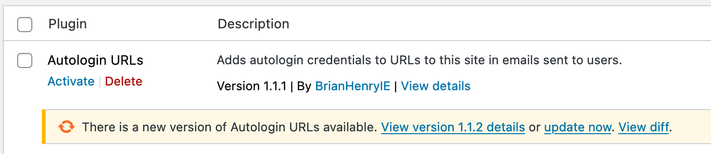
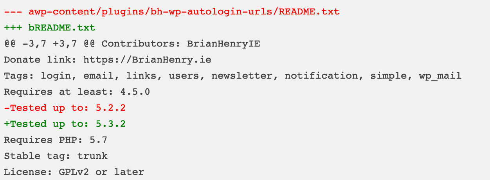

[](https://wordpress.org/plugins/plugin_slug) [](https://github.com/WordPress-Coding-Standards/WordPress-Coding-Standards) [](https://brianhenryie.github.io/plugin_slug/)

# Plugin Update Git Diffs

When a plugin update becomes available, run `git diff` on it and save as a custom post type, linked from the plugins screen.

Adds "View diff" to plugins.php



Which links to a diff:



No settings.

[Download from releases](https://github.com/BrianHenryIE/bh-wp-plugin-update-git-diffs/releases). Note: not WordPress.org because this plugin is in its infancy. Please report issues (ideally via PR).

## Notes

### Clear important transient

When testing, run this to clear the transient to force it be rebuilt and trigger the plugin: 

`vendor/bin/wp transient delete update_plugins --network`

This should be added to a ~"has plugin just been updated" function.

## TODO

Should also execute on zips when uploaded.

Rather than using Git on the server (may not exist), use: `composer require sebastian/diff`

Logger is janky. 

## Contributing

Clone this repo, open PhpStorm, then run `composer install` to install the dependencies.

```
git clone https://github.com/brianhenryie/plugin_slug.git;
open -a PhpStorm ./;
composer install;
```

For integration and acceptance tests, a local webserver must be running with `localhost:8080/plugin_slug/` pointing at the root of the repo. MySQL must also be running locally – with two databases set up with:

```
mysql_username="root"
mysql_password="secret"

# export PATH=${PATH}:/usr/local/mysql/bin

# Make .env available to bash.
export $(grep -v '^#' .env.testing | xargs)

# Create the databases. (one CREATE USER for MySQL, one for MariaDB).
mysql -u $mysql_username -p$mysql_password -e "CREATE USER '"$TEST_DB_USER"'@'%' IDENTIFIED WITH mysql_native_password BY '"$TEST_DB_PASSWORD"';";
mysql -u $mysql_username -p$mysql_password -e "CREATE USER '"$TEST_DB_USER"'@'%' IDENTIFIED BY '"$TEST_DB_PASSWORD"';";
mysql -u $mysql_username -p$mysql_password -e "CREATE DATABASE "$TEST_SITE_DB_NAME"; USE "$TEST_SITE_DB_NAME"; GRANT ALL PRIVILEGES ON "$TEST_SITE_DB_NAME".* TO '"$TEST_DB_USER"'@'%';";
mysql -u $mysql_username -p$mysql_password -e "CREATE DATABASE "$TEST_DB_NAME"; USE "$TEST_DB_NAME"; GRANT ALL PRIVILEGES ON "$TEST_DB_NAME".* TO '"$TEST_DB_USER"'@'%';";
```

### WordPress Coding Standards

See documentation on [WordPress.org](https://make.wordpress.org/core/handbook/best-practices/coding-standards/) and [GitHub.com](https://github.com/WordPress/WordPress-Coding-Standards).

Correct errors where possible and list the remaining with:

```
vendor/bin/phpcbf; vendor/bin/phpcs
```

### Tests

Tests use the [Codeception](https://codeception.com/) add-on [WP-Browser](https://github.com/lucatume/wp-browser) and include vanilla PHPUnit tests with [WP_Mock](https://github.com/10up/wp_mock). 

Run tests with:

```
vendor/bin/codecept run unit;
vendor/bin/codecept run wpunit;
vendor/bin/codecept run integration;
vendor/bin/codecept run acceptance;
```

Output and merge code coverage with:

```
XDEBUG_MODE=coverage composer run-script coverage-tests
```

To save changes made to the acceptance database:

```
export $(grep -v '^#' .env.testing | xargs)
mysqldump -u $TEST_SITE_DB_USER -p$TEST_SITE_DB_PASSWORD $TEST_SITE_DB_NAME > tests/_data/dump.sql
```

To clear Codeception cache after moving/removing test files:

```
vendor/bin/codecept clean
```

### More Information

See [github.com/BrianHenryIE/WordPress-Plugin-Boilerplate](https://github.com/BrianHenryIE/WordPress-Plugin-Boilerplate) for initial setup rationale. 

# Acknowledgements